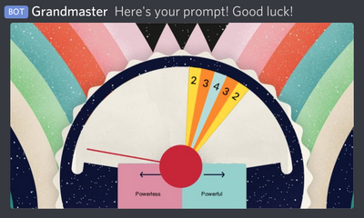

# Grandmaster

_A discord bot for fun and games_

## What is this?

Unable to play board games in person, I thought a Discord Bot might be able to help for some games. Currently, it only plays one game.

## Features:
### Wavelength
#### Generate the prompt
```
!w @username
```


PM's the tagged user with a clue and a gauge. Do this from the room you want to run the game in.

#### Adjust the dial
```
!w +10
```


In the room the game is running in, adjusts the dial by 10 degrees clockwise. Similarly, you can use -10 to reduce it by ten degrees. You can use any number, not just 10. No absolute figures though, only adjustments!

#### Reveal the answer
```
!w reveal
```


In the room the game is running in, reveal the gauge and score where the dial ended up.

### Teams
This feature probably doesn't work terribly well on servers with existing roles, but that's not the case on the server it was built for, so it's here regardless!
```
!teams @user1 @user2
```
Randomly divide the supplied users as evenly as possible in to two teams (roles). These roles are named randomly from a list; if you already have roles of the form 'The verbing nouns', there might be some cross-talk, so be careful of that.
```
!teams clear
```
Remove all users from teams.

## Installation

To add this to your Discord server... we don't know yet.

## Credits

* [@area](https://github.com/area/)
* [@practual](https://github.com/practual/)
* [@ChrisEngland](https://github.com/ChrisEngland/)